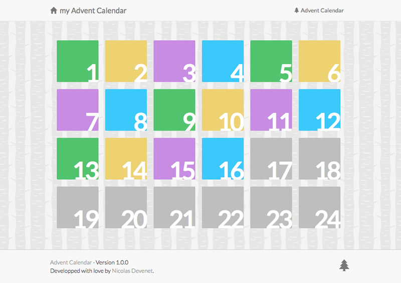
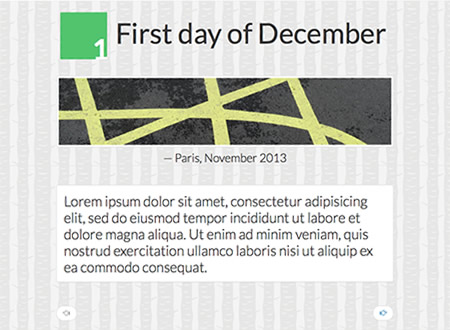

# AdventCalendar

Advent Calendar is a light web application to show a picture and its legend per day before Christmas, or any other event.  
It’s written in PHP, use last web technologies—and proud to not support obsolete versions of IE.

→ [See a demo](https://www.devenet.eu/advent/demo).




***

## You are in a hurry?

OK, let's do it quickly!

```
git clone https://github.com/Devenet/AdventCalendar advent
cd advent/private
cp settings.example.json settings.json
```

Then edit the `settings.json` file to configure the application and set the year — or [generate settings file](https://www.devenet.eu/advent/generator/#settings) and put it in the `private` folder.

To finish, just put your image files in the `private` folder; images named with the number of the day (such as `1.jpeg`, `2.jpg`, `3.png`).  
Supported formats are: JPG/JPEG, PNG, GIF.

***

## Installation

### Get the source

Download the last version on the [releases page](https://github.com/Devenet/AdventCalendar/releases).

### Or clone the repository

If you have git on your server, you can also just clone the repository with:

```
git clone https://github.com/Devenet/AdventCalendar advent
```

## Configuration

### Basic configuration

Copy the `settings.example.json` file on folder `private` to `settings.json` and edit it to configure the application.

The minimum required configuration file must contains:
```json
{
  "title": "Advent Calendar · 2021",
  "year": 2021
}
```

### Transform AdventCalendar into CountDownCalendar

If you want, you can also customize month, first day and last day which are used to display the period of days, but it's not really an AdventCalendar anymore ;-)

Just change the period with those 3 options:
```json
{
  "month": 3,
  "first_day": 8,
  "last_day": 31
}
```
It will make a countdown calendar for March from the 8th to the 31th.

### Full available options

_Feel free to use the online [settings file generator](https://www.devenet.eu/advent/generator/#settings) to easily build your `settings.json` file, and then put it into the `private` folder._

| Property | Type | Description |
| --- | --- | --- |
| __`title`__ | string | __Required__ Set the title of your AdventCalendar. |
| __`year`__ | integer | __Required__ Set the year to be used for the calendar and the cutdown. |
| __`month`__ | integer | Specific month to turn on a countdown calendar. Default is 12. |
| __`first_day`__ | integer | Specific first day to turn on a countdown calendar. Default is 1. |
| __`last_day`__ | integer | Specific last day to turn on a countdown calendar. Default is 24. |
| __`lang`__ | string | Supported languages are `en` (default), `fr`, `de`. |
| __`background`__ | string | Set to `alternate` to use the alternative background, otherwise set the URL of your custom background image. |
| __`passkey`__ | string | If filled out, visitors need to enter a password to access the private AdventCalendar. |
| __`disqus_shortname`__ | string | Set a Disqus account to enable comments for day pages. |
| __`google_analytics`__ | object | Set a Google Analytics account with a child object containing the two properties `tracking_id` and `domain`. |
| __`piwik`__ | object | Set a Piwik account with a child object containing the two properties `piwik_url` and `site_id`. |
| __`plausible`__ | object | Set a Plausible account with a child object containing the property `domain` for _data-domain_, and if you use a CNAME custom domain the property `custom_src` with the full URL in the Plausible _src_ configuration. |
| __`copyright`__ | string | Set a copyright notice; not displayed if empty (default). |
| __`url_rewriting`__ | boolean | Set to `true` to enable rewriting URL and uncomment lines in the root `.htaccess` file. Default is `false`. |


This is an example with all options:
```json
{
  "title": "Advent Calendar · 2020",
  "year": 2020,
  "month": 12,
  "first_day": 1,
  "last_day": 24,
  "lang": "en",
  "background": "alternate",
  "passkey": "My top secret password!",
  "disqus_shortname": "myDisqusName",
  "google_analytics": {
    "tracking_id": "UC-12345",
    "domain": "domain.tld"
  },
  "piwik": {
    "piwik_url": "piwik.domain.tld",
    "site_id": "12345"
  },
  "plausible": {
    "domain": "domain.tld",
    "custom_src": "https://cname.domain.tld/js/index.js"
  },
  "copyright": "All content is under Creative Commons BY-NC 3.0 licence.",
  "url_rewriting": false
}
```

## Picture per days

### Add pictures

Put your photos in the `private` folder, and name them with the number of the day you want to illustrate.
For example, for the 1st December, call your file `1.jpg` or `1.jpeg`.  

Supported formats are: JPG/JPEG, PNG, GIF.

__Be sure that the access to `private` folder is forbidden when browsing it!__   
For Apache configuration, be sure that a `.htaccess` file with the directive `Require all denied` is in and read.

### Customize legend and title

_Feel free to use the online [calendar file generator](https://web.devenet.eu/advent/generator/#calendar) to easily build your `calendar.json` file, and then put it into the `private` folder._

To add a title, a legend or a text on a day page, just rename `calendar.example.json` in folder `private` in `calendar.json` and add what you want to display.

For example:

```json
{
  "6": {
    "title": "Saint Nicholas Day",
    "legend": "Berlin, March 2013",
    "text": "Lorem ipsum dolor sit amet, […]."
  }
}
```

#### Add a link

If you want that the image and legend point to a link, add the property `link` to the `calendar.json`:

```json
{
  "8": {
    "legend": "Screnshot of Advent Calendar",
    "link": "https://www.devenet.eu/advent"
  }
}
```



***

## Oups, problems?

- __All days are shown before Christmas:__ Check the syntax in `settings.json` or update the year.
- __Photo is not displayed:__ Be sure your photo is correctly named, like `3.jpg` or `12.jpeg` with the supported formats.
- __Title, legend or text are not displayed:__ Check the syntax of your `calendar.json` file.
- __Day is shown in late or advance:__ Configure the timezone of your server.


## Want to contribute?

Source code is developed by [Nicolas Devenet](https://nicolas.devenet.info) and hosted on [GitHub](https://github.com/Devenet/AdventCalendar). Feel free to fork it and to improve the application!

Let me know if you use Advent Calendar by sending me an e-mail, I will be happy ;-)

—

Special thanks to
- [@fscholdei](https://github.com/fscholdei) for the German translation
- [@Thaoh](https://github.com/Thaoh) for the Norwegian translation and the URL custom background feature
